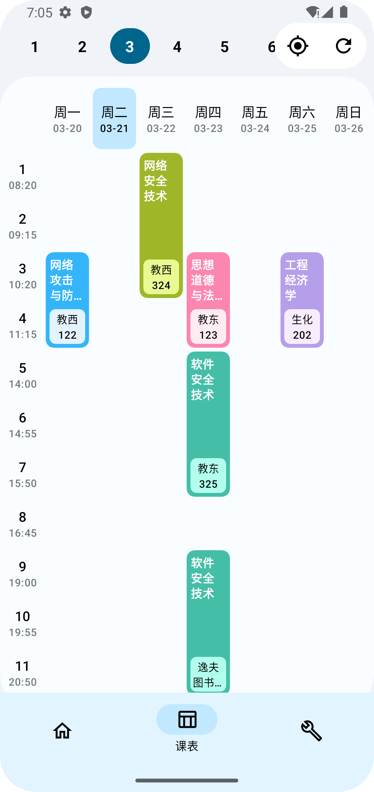
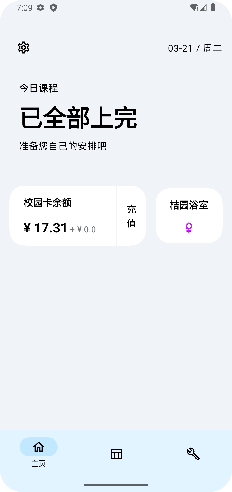
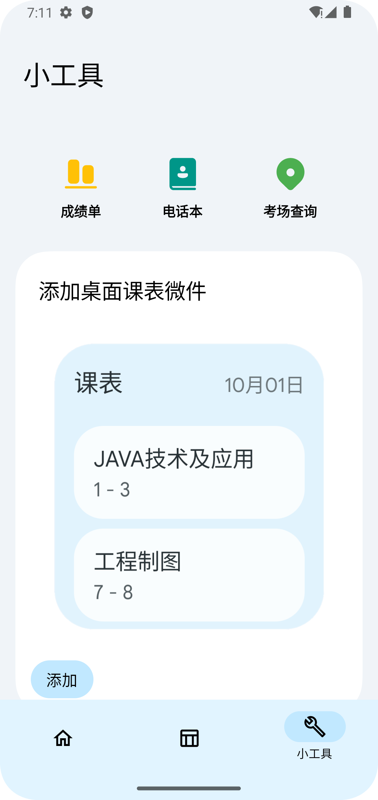
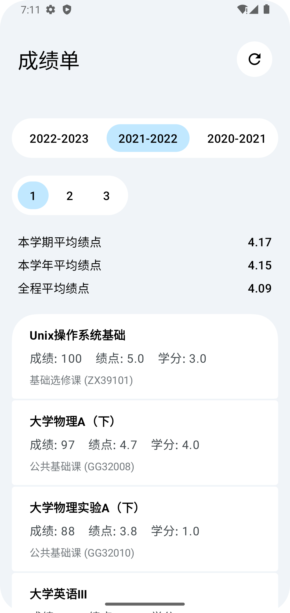
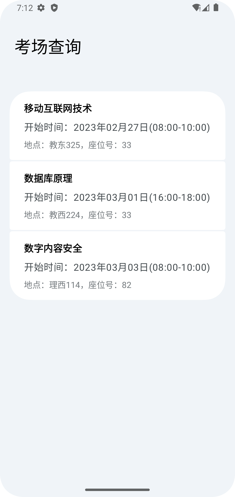
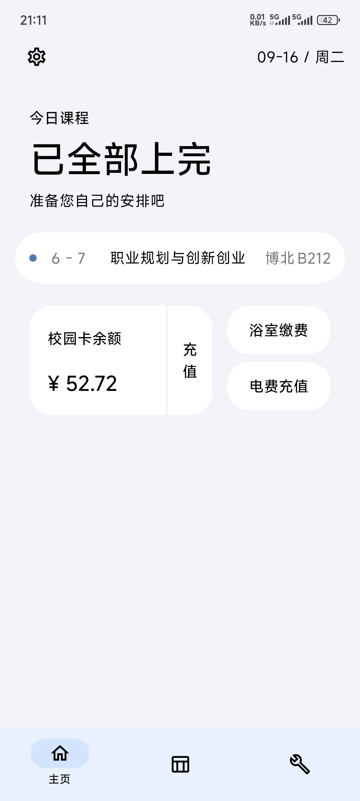
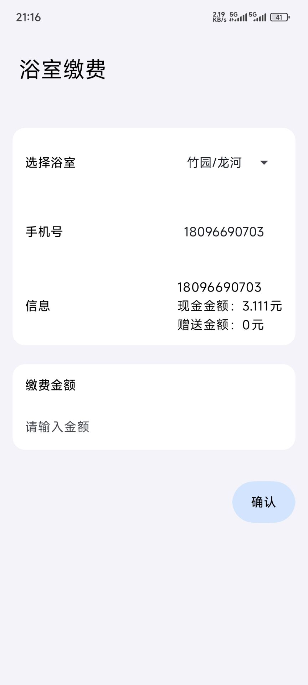
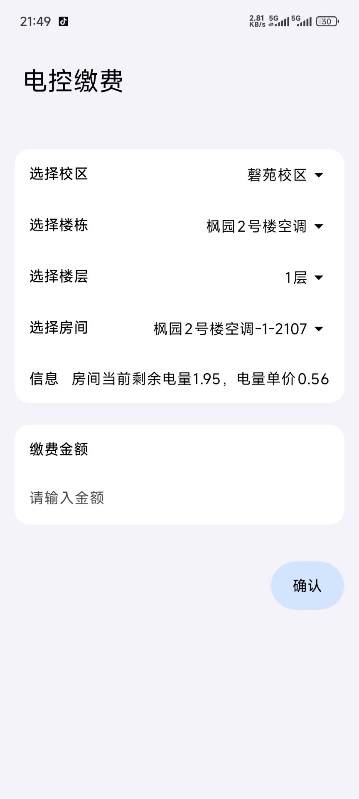

# 安大通

安大通是一个立足于安徽大学，由安徽大学学生自发开发的集校园一卡通、电子课表、成绩查询、考试查询等实用功能于一体的App

## 技术栈
安大通 App 采用 MVVM 架构使用全新的 Compose UI框架开发，开发语言以 Kotlin 为主，有少量 Java 代码。

## 软件展示
软件部分界面效果如下：

    
    
    

    
    
    

更新了部分内容（2025.9）：

    
    
    

## A Historic Moment
An era has ended — **2025-11-01**.

