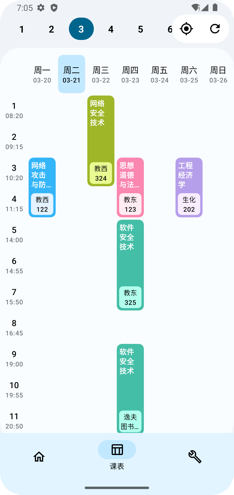
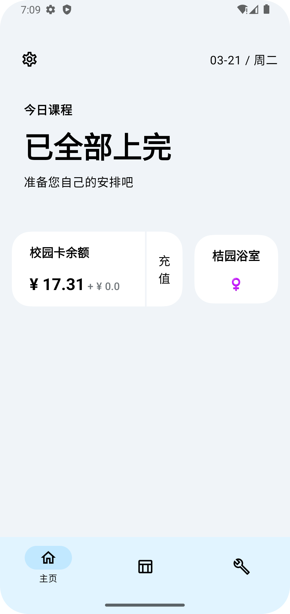
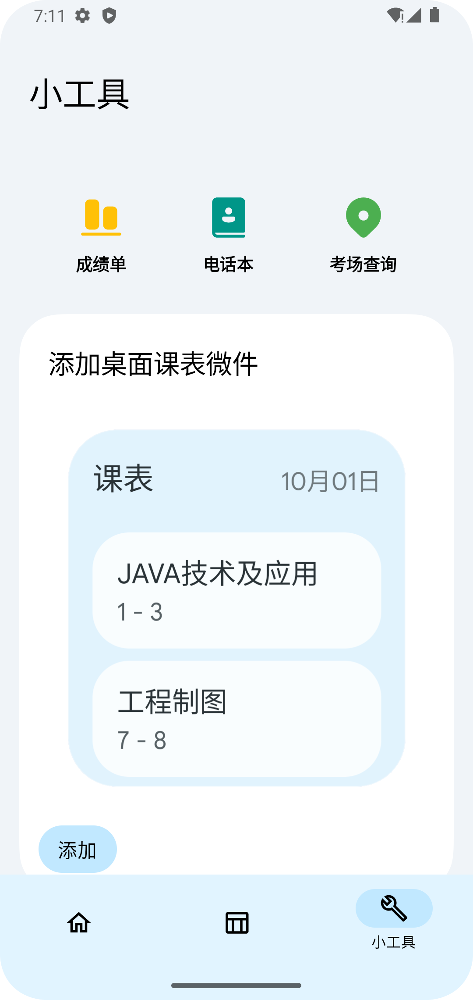
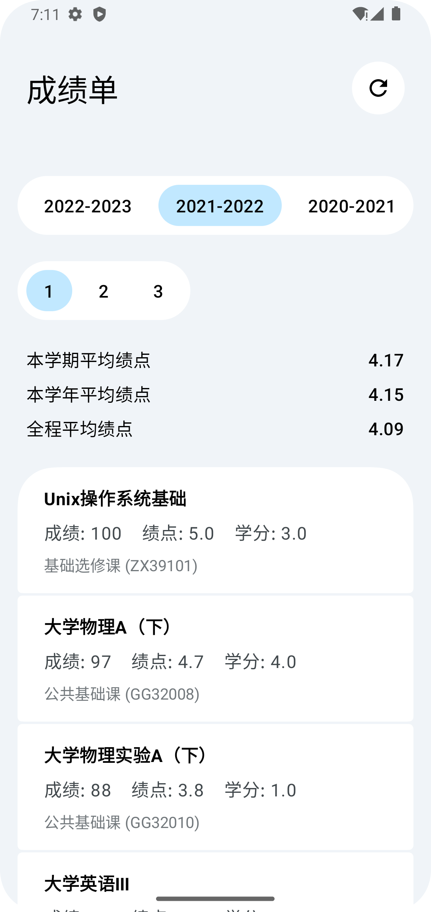
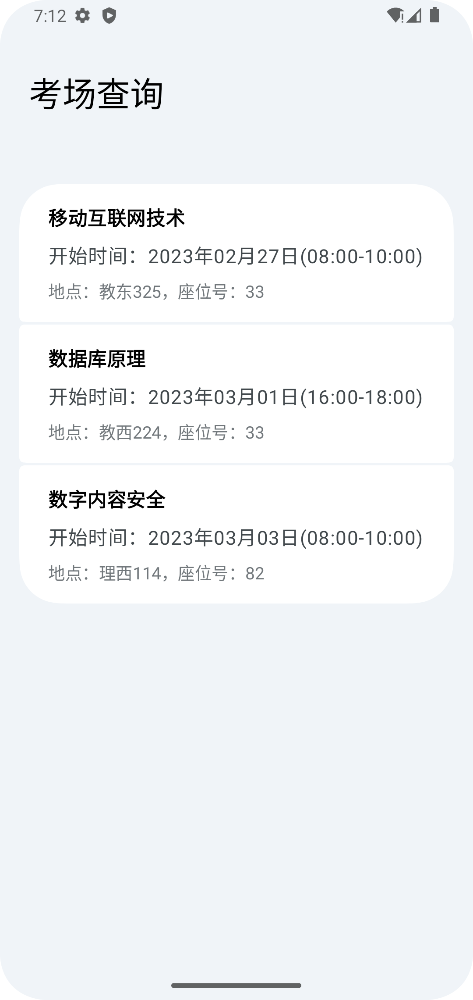
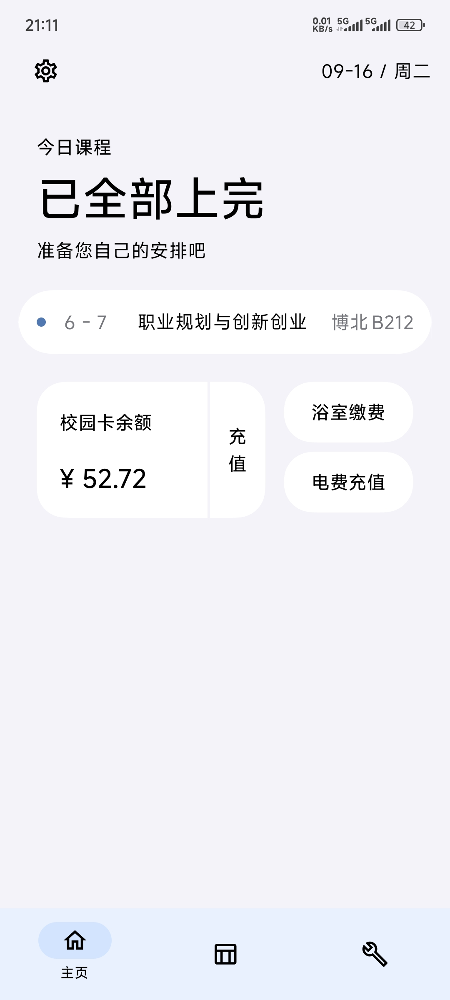
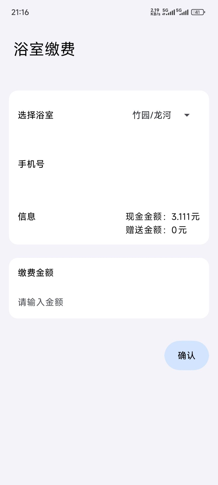
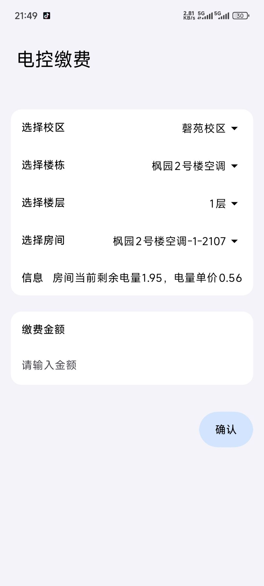

# 安大通

安大通是一个立足于安徽大学，由安徽大学学生自发开发的集校园一卡通、电子课表、成绩查询、考试查询等实用功能于一体的App

## 技术栈

安大通正在建设 AIO（All in One）仓库，用于统一管理不同平台的客户端。

Android 客户端采用 MVVM 架构，UI 使用 Jetpack Compose 和 Material 3，以 Kotlin 为主并包含少量 Java 代码；核心校园数据能力由 Rust SDK 提供，经 JNI 接入 Android，并使用 Tokio、Axum 和 Reqwest 实现本地服务及网络访问。

HarmonyOS 客户端预计使用 ArkTS 和 ArkUI，iOS 客户端预计使用 Swift 和 SwiftUI。

## 软件展示
软件部分界面效果如下：

    
    
    

    
    
    

更新了部分内容（2025.9）：

    
    
    

## A Historic Moment
An era has ended — **2025-11-01**.

